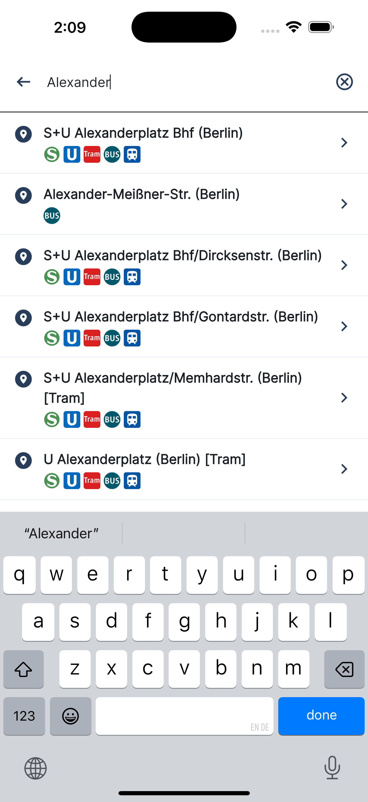
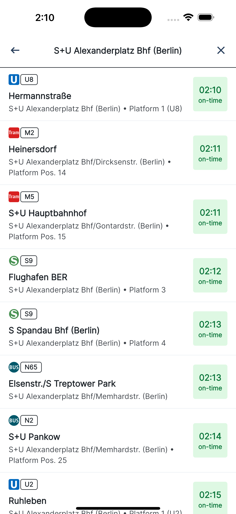

# Lanes & Planes - BVG Departures

Flutter app that shows upcoming departures for BVG stops using REST API.

## Features
- [x] Search for BVG stops with auto complete suggestions.
- [x] Selection of one stop from the auto complete suggestions.
- [x] Ascending ordered list of the next 30 departures from the selected stop.
- [x] Each departure list item shows name, icon, direction, time, potentials delays or cancellations and a platform.
- [x] Clear the search field and start with a new search for a stop
- [x] Loading state until the data is available.
- [x] Error state if the data is unavailable.
- [x] Empty state if there are no results.
- [x] BLoC pattern for state management.
- [x] Dependency injection using `get_it`.
- [x] Localization for `English` and `Deutsch` using `flutter_localizations`.
- [x] Clean architecture with Data, Domain, and Presentation layers.
- [x] Unit tests for DataSource, Repository, UseCase, and Bloc.
- [x] Widget tests for main page views.
- [x] `GoRouter` for navigation.
- [x] `Dio` for network calls.

## Screenshots
| Home | Search | Departures | Error |
| --- | --- | --- | --- |
|  |  |  |  |

## Screen recording
| Search & List Departures |
| --- |
| <video src="https://github.com/user-attachments/assets/cb8d23b3-981a-4538-8772-ba9fa563837f" controls> |

## Pre-requisites
Make sure you have following or latest flutter/dart sdk installed on your machine. If not, follow the instructions [here](https://flutter.dev/docs/get-started/install).

`flutter: 3.32.8`
`dart: 3.8.1`

## Setup
1. Generated files are added to git, but in case you need fresh copies, run the following commands:
```sh
$ flutter pub get
$ dart run build_runner build --delete-conflicting-outputs
```

2. To run the app, launch from VS Code or use the following command:
```sh
$ flutter run --target lib/main.dart
```
